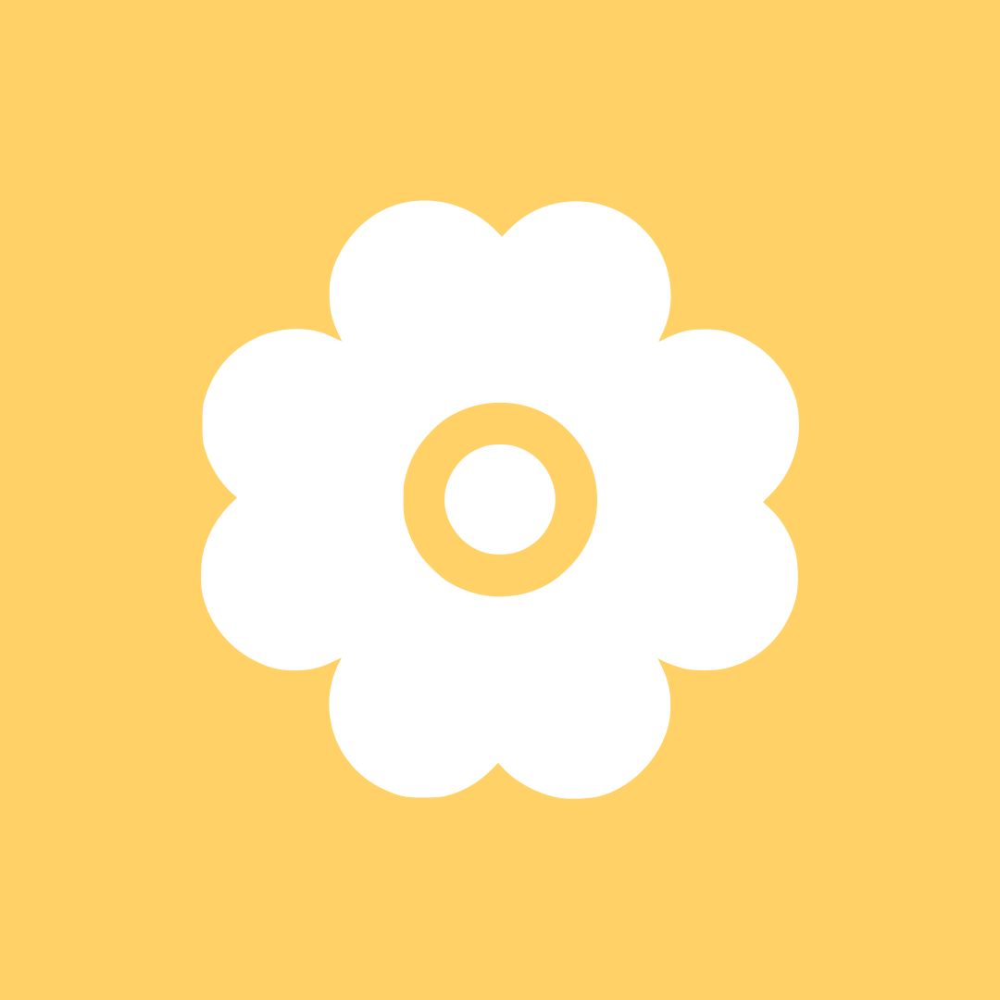
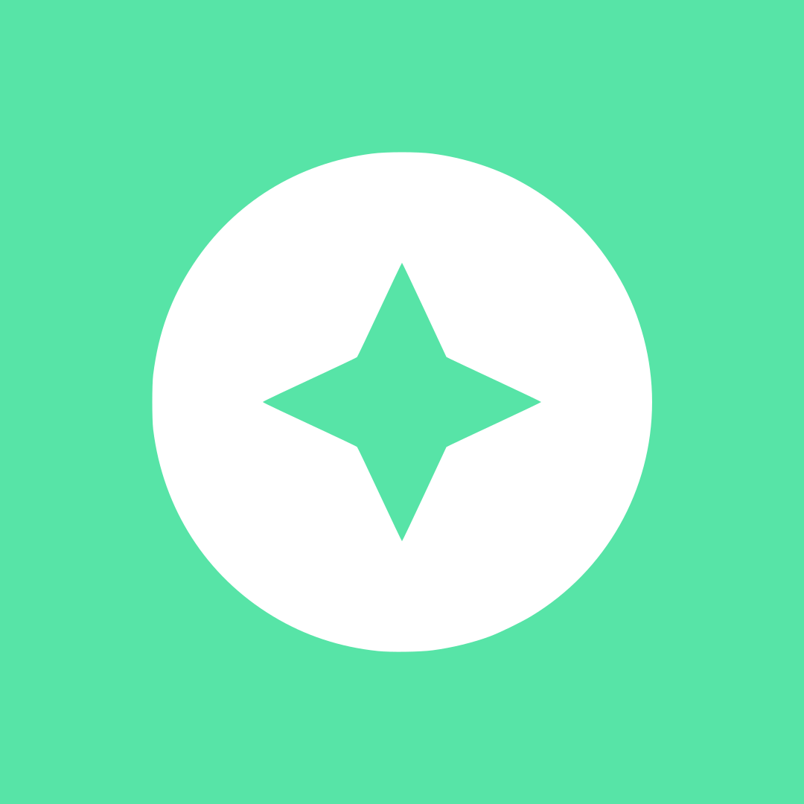

## Welcome

> [!IMPORTANT]
> We are open to collaborations (mail us at talk@bluetobystudio.com)

I founded the Blue Toby Studio in 2025 to hub all my crazy and not-so-crazy ideas.

## Vision

The joy of creation is a very niche sentiment. That satisfaction you have when you click the "Publish" button of something you put your sweat into. So I decided to devote myself to prolonging this sentiment while sharing my work with the world, by founding Blue Toby Studio, an independent software creation studio.

## Next releases

Currently developing a new puzzle game titled `SONOKLO`. It will launch on Android devices first. Depending on its success, we may release it for other platforms.

## Rules of existence

I bind the studio existence to three golden rules. I am stating them here to clarify (to me and to you all) what should be the goals of all the work I'm gonna put in this little project:

<!-- 

</img> <strong>Humans make games for other humans</strong> We won't encourage nor publish any AI generated content.

 -->

</img><strong>Humans make games for other humans</strong> We won't encourage nor publish any AI generated content.

</img><strong>Do what you love</strong> and love what you do.

</img> <strong>We create games for players, not for buyers</strong> Money isn't the objective of the studio. 

